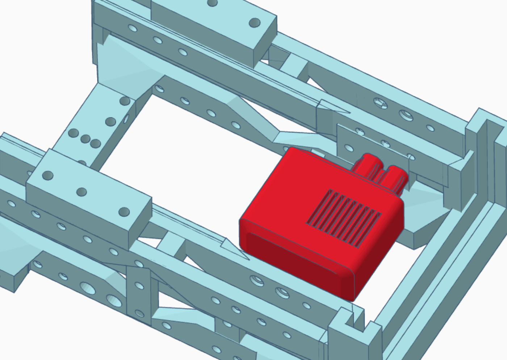

# TrackerBot

Designed by: William Sellery

This is a simple to assemble VEX linetracking oriented bot designed for classroom use, aided by the simple to use VEX ecosystem.

## Step 1 

Install the IMU as shown below, using a dark blue screw and nut.

[]
[]

## Step 2 

Install the Distance Sensor as shown using two dark blue screws.
[]

## Step 3 

Install one 5.5w motor with two red screws as shown below.
[]
[]

## Step 4 

Install the second 5.5w motor with two red screws in the orientation shown below.
[]

## Step 5 

Install 5 gears on the **right** chassis in the orientation shown below.
[]

## Step 6

Repeat step 5 on the **left** side of the chassis
[]

## Step 7

Install the 3 linetracking sensors in the middle three mounting holes as shown below. Use purple screws and mount the sensors with a 1/2in spacer.

[]

## Step 8 

Install the two optical sensors using two purple screws and a .5 inch spacer in the position shown below.
[]

## Step 9

Position the vex brain in the position shown below.
[]

## Step 10

Install the brain clips to each side of the vex brain.
[]

## Step 11

Screw in the two standoffs on each side using screws from below.
[]

## Step 12 
Attaching the handle.

Screw in the metal C-channel to the top of the two standoffs using two orange screws.
[]

## Step 13 

Slide in the battery over the two motorss

[]

